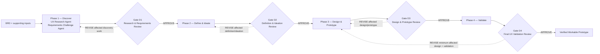

# AI UX Discovery-to-Prototype Pipeline

**Status: STABLE v2.0 — Deliverable 01**

## Goal

This documented AI design pipeline takes a BRD and supporting UX/research inputs through:

**BRD → Research → Ideation → Design → Validation → Verified Workable Prototype**

It preserves evidence traceability, separates facts from assumptions, uses reusable skills, and requires explicit human approval at every gate.

## Workflow Overview



REJECT stops at the current gate. Revision loops rerun only affected work and dependent outputs.

## Phases

| Phase | Purpose | Lead agent | Main skills | Main outputs | Gate |
|---|---|---|---|---|---|
| 1 — Discover | Analyze evidence, challenge the BRD, synthesize users and research gaps | UX Research Agent + Requirements Challenge Agent | Evidence analysis, advocate/cynic debate, persona and pain-point synthesis | BRD risk review, persona, pain points, research gaps | D1 |
| 2 — Define & Ideate | Frame problems and compare multiple candidate directions | UX Definition & Ideation Agent | Problem framing, journey mapping, opportunity prioritization, concept generation/evaluation | Problem definition, journey, opportunities, concept options, selected concept | D2 |
| 3 — Design & Prototype | Convert the approved concept into a demonstrable design | Experience Design Agent | User flow, information architecture, screens, interaction states, prototype generation | User flow, screen spec, interaction states, prototype spec/output | D3 |
| 4 — Validate | Perform synthetic UX, accessibility, design-system, requirement, and edge-case audits | UX Validation & Audit Agent | Synthetic usability, cognitive friction, accessibility, design system, requirement coverage, edge cases | Validation report/issues, requirement coverage, accessibility audit | D4 |

## Agent Model

- **Orchestrator:** reads configuration/state and routes eligible work; it does not replace agents or author phase artefacts.
- **Phase:** a bounded stage with explicit entry criteria, inputs, outputs, skill order, and exit gate.
- **Agent:** owns a phase responsibility and produces traceable artefacts.
- **Skill:** a reusable capability invoked by an agent, such as concept evaluation or accessibility audit.
- **Gate:** a human decision point that prevents automatic advancement.
- **Project config:** stable workflow structure, paths, and governance rules in `project.config.md`.
- **Project state:** runtime progress, gate status, artefact currency, and next action in `project.state.md`.

## Human-in-the-Loop

Every gate accepts only:

- **APPROVE:** advance to the next phase; D4 APPROVE completes the workflow.
- **REVISE:** rerun the minimum affected skill and dependent work, then return to the gate.
- **REJECT:** stop and record the reason.

Agents, the orchestrator, and automated checks cannot self-approve. Silence or a generic request to continue is not approval.

## AI Safety & Evidence Rules

- Never invent research, users, quotations, requirements, findings, or validation results.
- Keep facts, BRD statements, inferences, assumptions, design hypotheses, and risk hypotheses distinguishable.
- Preserve source locators and evidence lineage across handoffs.
- Use HIGH, MEDIUM, LOW, and CONTRADICTORY confidence where required.
- Requirements Challenge risks cannot become persona facts or pain points without independent evidence.
- Synthetic usability and cognitive-friction results are heuristic, not empirical user research.
- Accessibility review reports risks or potential conformance issues and cannot claim full WCAG compliance without sufficient evidence and human validation.
- The prototype is not verified/workable until explicit D4 APPROVE.

## Assignment Traceability

| Assignment requirement | Workflow coverage |
|---|---|
| Research | Phase 1 — Discover |
| Ideation | Phase 2 — Define & Ideate |
| Design | Phase 3 — Design & Prototype |
| Validation | Phase 4 — Validate |
| Workable prototype | Phase 3 prototype output plus Phase 4 evidence and D4 APPROVE |

## Current Scope

This submission represents **Deliverable 01: AI Design Pipeline Documentation**. It defines the complete Markdown workflow architecture, contracts, governance, tests, public documentation site, and a runnable synthetic UX prototype. The documented workflow has completed D1–D4 with explicit human approval.

The included Python utility validates and demonstrates deterministic workflow contracts; it does not replace the Markdown agents or perform autonomous LLM execution. The local prototype and Phase 4 findings remain limited to the documented synthetic demo scope.

## Interactive Streamlit Demo

`streamlit_app.py` provides a browser-based runner showing all four phases, responsible agents, ordered skills, generated artifacts, and explicit D1-D4 human decisions.

- **Demo mode** replays checked-in synthetic artifacts without an API key or repository writes.
- **Live AI mode** sends synthetic demo inputs to Gemini and accepts only the phase's declared output paths. Store `GEMINI_API_KEY` in Streamlit secrets; never commit it.

Run locally:

```powershell
python -m pip install -r requirements.txt
streamlit run streamlit_app.py
```

For Streamlit Community Cloud, select this repository, the `main` branch, and `streamlit_app.py`. Demo mode works immediately. To enable Live AI mode, add the following under the deployed app's **Settings > Secrets**:

```toml
GEMINI_API_KEY = "your-key"
LIVE_AI_PASSWORD = "a-long-unique-password"
```

`LIVE_AI_PASSWORD` protects the public Live AI control from casual unauthorized use. Demo mode remains public and consumes no model quota. Treat this as a shared-demo safeguard, not as user-account authentication; rotate it if it is disclosed.

GitHub Pages remains the documentation and static prototype host; Streamlit hosts the executable workflow runner.

Public runner: **https://ai-ux-design-pipeline.streamlit.app/**

## GitHub Pages

The public documentation site lives in `docs/` and uses dependency-free HTML, CSS, and JavaScript. It can be hosted directly with GitHub Pages:

1. Push the repository to GitHub.
2. Open **Settings → Pages**.
3. Under **Build and deployment**, choose **Deploy from a branch**.
4. Select the default branch and the `/docs` folder, then save.

The published site includes the interactive pipeline, agent ownership, artifact explorer, evidence rules, visual diagrams, and the runnable appointment prototype. No Python server is required on GitHub Pages.
